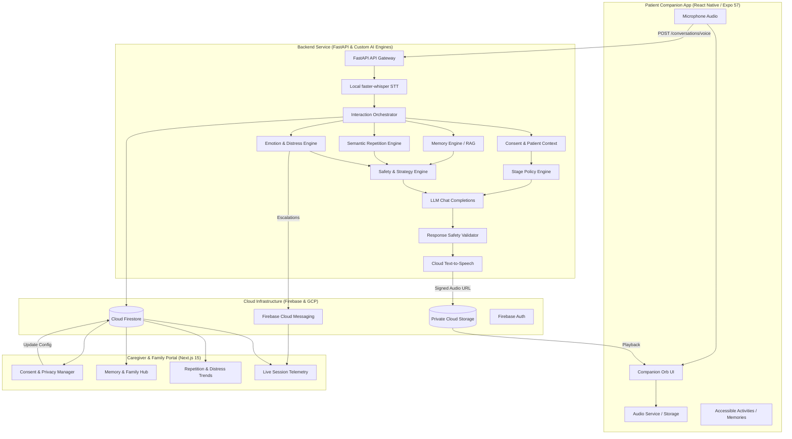

# GeriCare AI

> **Voice-first, stage-adaptive AI companion & caregiver telemetry platform for dementia and Alzheimer's care.**

[](LICENSE)
[](backend/)
[](mobile/)
[](website/)
[](https://firebase.google.com/)

---

## 1. Product Overview & Vision

**GeriCare AI** is an assistive healthcare platform engineered to support seniors living with Alzheimer's disease and related dementias, their primary family circles, and professional caregivers.

Dementia brings severe cognitive disorientation, memory regression, repetitive questioning driven by anxiety, and evening agitation (sundowning). Conventional voice assistants fail in this environment—they either argue facts, repeat cold encyclopedic answers, or leak confusing technical feedback. 

GeriCare AI bridges this gap through a tri-part ecosystem:
1. **Patient Companion App (`mobile/`)**: An accessible, voice-first tablet/mobile application with an organic breathing interface, comforting memories, familiar family voice notes, and zero clinical exposure.
2. **Caregiver & Family Portal (`website/`)**: A Next.js 15 web application enabling real-time telemetry, acoustic distress monitoring, repetition analytics, evening pattern visualization, and granular privacy controls.
3. **Intelligence & Safety Backend (`backend/`)**: A FastAPI service orchestrating local speech recognition, consent-gated memory retrieval, safety and strategy engines, LLM generation, response validation, and server-side speech synthesis.

---

## 2. The Core Principle: *"The LLM is not GeriCare"*

```
┌──────────────────────────────────────────────────────────────────────────────────┐
│                                   GERICARE AI                                    │
│                                                                                  │
│   Verified Biography  •  Consent Gate  •  Cognitive Stage  •  Semantic Repetition│
│   Emotion Detection   •  Distress Risk •  Evening Patterns •  Response Strategy  │
│                                       │                                          │
│                                       ▼                                          │
│                         ┌───────────────────────────┐                            │
│                         │   Structured Strategy     │                            │
│                         │   & Context Constraints   │                            │
│                         └─────────────┬─────────────┘                            │
│                                       ▼                                          │
│                         ┌───────────────────────────┐                            │
│                         │            LLM            │                            │
│                         │ (Natural Language Voice)  │                            │
│                         └─────────────┬─────────────┘                            │
│                                       ▼                                          │
│                         ┌───────────────────────────┐                            │
│                         │ Response Safety Validator │                            │
│                         └───────────────────────────┘                            │
└──────────────────────────────────────────────────────────────────────────────────┘
```

The Large Language Model never independently decides clinical staging, safety policy, memory disclosure, or caregiver escalation. GeriCare is the deterministic, healthcare-grade intelligence layer surrounding the LLM:
* **Stage-Aware**: Cognitive stage (Early, Moderate, Late) is exclusively configured by caregivers and clinicians, never inferred by AI.
* **Consent-Enforced**: Patient consent rules are evaluated *before* biographical facts reach the LLM context window.
* **Validation Guard**: Every generated response passes through a strict pre-TTS safety validator that blocks unverified belief confirmation, hallucinated medical advice, and restricted memory disclosure.
* **Emergency Isolation**: Dangerous statements bypass generative conversation entirely and trigger immediate caregiver notifications and alerts.

---

## 3. System Architecture



---

## 4. Repository Structure

```text
gericare-monorepo/
├── backend/                  # FastAPI intelligence service & AI safety engines
│   ├── app/
│   │   ├── ai/               # Stage, repetition, emotion, distress, memory & strategy engines
│   │   ├── api/v1/           # REST endpoints (auth, patients, pairing, conversations, alerts)
│   │   ├── core/             # Security, RBAC, audit, rate limiting, logging
│   │   ├── database/         # Firebase Admin init & Firestore/Storage repositories
│   │   ├── schemas/          # Pydantic v2 schemas (patient-safe vs caregiver projections)
│   │   └── services/         # Business logic layer
│   ├── tests/                # Unit tests for AI engines & integration orchestrator tests
│   ├── firestore.indexes.json# Composite indexes required by Firestore
│   ├── Dockerfile            # Container deployment configuration
│   └── README.md             # In-depth backend architecture guide
│
├── mobile/                   # Patient Companion Tablet/Phone App
│   ├── app/                  # Expo Router file-based screens (onboarding, home, companion, memories)
│   ├── src/
│   │   ├── components/       # Accessible UI, GeriButton, CompanionOrb, state views
│   │   ├── services/         # Axios API clients with auto 401 token refresh
│   │   ├── store/            # Zustand state (companion voice state, settings)
│   │   └── theme/            # Calm healthcare color tokens & accessibility sizes
│   └── README.md             # In-depth mobile app guide & design system
│
├── website/                  # Caregiver & Family Web Portal
│   ├── app/                  # Next.js 15 App Router pages (dashboard, telemetry, patients, alerts)
│   ├── src/
│   │   ├── components/       # Telemetry charts (Recharts), patient profiles, modals
│   │   ├── services/         # Centralized API and WebSocket communication
│   │   ├── store/            # Session, patient context, and drawer state
│   │   └── types/            # Strict TypeScript domain interfaces
│   └── README.md             # In-depth web portal guide
│
├── docs/                     # Architectural audits, integration reports & content maps
│   ├── WEB_PORTAL_API_AUDIT.md
│   ├── WEB_PORTAL_CONTENT_MAP.md
│   ├── WEB_PORTAL_FINAL_INTEGRATION.md
│   ├── patient-endpoint-audit.md
│   └── patient-integration-verification.md
│
├── scripts/                  # Repository utility & encoding normalization scripts
├── package.json              # Monorepo root configuration & lint scripts
└── eslint.config.mjs         # Monorepo ESLint configuration
```

---

## 5. Subproject Breakdown

### 5.1 Backend (`backend/`)
* **Framework**: FastAPI with Pydantic v2 and Python 3.11+.
* **Local STT**: Runs [faster-whisper](https://github.com/SYSTRAN/faster-whisper) locally. No speech data leaves the server to third-party STT vendors, preserving patient privacy and eliminating per-transcription API fees.
* **Vector & Memory Engine**: Uses `sentence-transformers/all-MiniLM-L6-v2` loaded once on startup for semantic repetition detection and contextual RAG memory retrieval.
* **Dual Authentication**:
  * **Caregiver / Family**: Firebase ID token verified server-side with RBAC enforced from Firestore (`users/{uid}.role`).
  * **Patient Device**: Short-lived JWT issued following a single-use pairing code verification.
* **Zero Mock Data**: Endpoints strictly return Firestore-backed data, compassionate empty structures, or controlled error states.

👉 *Read more in the [Backend README](backend/README.md).*

### 5.2 Mobile Companion App (`mobile/`)
* **Framework**: React Native 0.86.3 with Expo SDK 57 (Expo Router).
* **Calm Healthcare Aesthetics**: High contrast typography (`#0F172A`), soft mints, warm whites (`#FAF9F6`), and muted teals. No jarring alarms, spinning wheels, or clinical alerts.
* **Companion Orb**: An atmospheric breathing visualizer powered by `expo-linear-gradient` and subtle haptic feedback (`expo-haptics`).
* **Adaptive Comfort Mode**: Automatically triggers when the backend flags vocal distress, shifting the UI to a warmer atmosphere with grounding family photos and soothing audio.
* **Accessible Hardware Integration**: Encrypted credential storage via `expo-secure-store`, high-quality recording via `expo-audio`, and offline detection via `@react-native-community/netinfo`.

👉 *Read more in the [Mobile App README](mobile/README.md).*

### 5.3 Caregiver & Family Portal (`website/`)
* **Framework**: Next.js 15 (React 19, App Router) and Tailwind CSS.
* **Telemetry & Analytics**: Recharts-powered trend analysis covering 24-hour routine cycles, evening distress spikes (sundowning), and recurring queries.
* **Personal Memory Catalog**: Upload and organize life stories, relatives, and historical photographs, configured with granular patient visibility controls.
* **Privacy & Legal Consent**: Real-time toggles for AI memory inclusion, voice clip playback, and data retention policies.
* **Device Pairing Center**: Generates time-limited, hashed one-time pairing codes and PINs for companion tablets.

👉 *Read more in the [Web Portal README](website/README.md).*

---

## 6. Getting Started

### Prerequisites
* **Python**: `3.11+`
* **Node.js**: `18.18+` or `20+` (tested on Node v24)
* **Package Manager**: `npm 9+`
* **Firebase Project**: An active Firebase project with Firestore, Authentication, Cloud Storage, and FCM enabled.
* **Google Cloud SDK**: (`gcloud`) for Application Default Credentials (recommended) or a service account key.

---

### Step 1: Clone & Install Root Dependencies

```bash
git clone <repo-url> gericare-monorepo
cd gericare-monorepo

# Install root dependencies for monorepo linting
npm install
```

---

### Step 2: Backend Setup

```bash
cd backend

# Create and activate Python virtual environment
python -m venv .venv
# On Windows (PowerShell / Git Bash):
source .venv/Scripts/activate
# On macOS / Linux:
source .venv/bin/activate

# Install dependencies
pip install -r requirements.txt

# Configure environment variables
cp .env.example .env
```

Configure your `.env` file with your Firebase project ID, OpenRouter/LLM credentials, and JWT secret:
```env
FIREBASE_PROJECT_ID=your-firebase-project-id
LLM_PROVIDER=openrouter
LLM_API_KEY=your-api-key
LLM_MODEL=anthropic/claude-3.5-sonnet
JWT_SECRET=your-jwt-secret-key
WHISPER_MODEL=base
```

Start the backend development server:
```bash
uvicorn app.main:app --reload --port 8000
```
Interactive OpenAPI documentation will be accessible at [http://localhost:8000/docs](http://localhost:8000/docs).

---

### Step 3: Web Portal Setup

```bash
cd ../website

# Install web dependencies
npm install

# Configure environment variables
cp .env.example .env.local
```

Populate `.env.local` with your public Firebase configuration and API endpoint:
```env
NEXT_PUBLIC_API_BASE_URL=http://localhost:8000
NEXT_PUBLIC_FIREBASE_API_KEY=your-api-key
NEXT_PUBLIC_FIREBASE_AUTH_DOMAIN=your-project.firebaseapp.com
NEXT_PUBLIC_FIREBASE_PROJECT_ID=your-project-id
NEXT_PUBLIC_FIREBASE_STORAGE_BUCKET=your-project.appspot.com
NEXT_PUBLIC_FIREBASE_MESSAGING_SENDER_ID=your-sender-id
NEXT_PUBLIC_FIREBASE_APP_ID=your-app-id
```

Run the development server:
```bash
npm run dev
```
Open [http://localhost:3000](http://localhost:3000) to access the Caregiver Portal.

---

### Step 4: Mobile App Setup

```bash
cd ../mobile

# Install mobile dependencies
npm install

# Configure environment variables
cp .env.example .env
```

Update `.env`:
```env
EXPO_PUBLIC_API_BASE_URL=http://localhost:8000
```

Start the Expo development server:
```bash
npx expo start
```
* Press `a` for Android Emulator.
* Press `i` for iOS Simulator.
* Scan the QR code using the Expo Go app on a physical tablet or phone.

---

## 7. Environment Variables Summary

| Scope | Location | Key Variables | Description |
|---|---|---|---|
| **Backend** | `backend/.env` | `FIREBASE_PROJECT_ID`, `LLM_API_KEY`, `JWT_SECRET`, `WHISPER_MODEL` | Server secrets, database handles, model parameters |
| **Web Portal** | `website/.env.local` | `NEXT_PUBLIC_API_BASE_URL`, `NEXT_PUBLIC_FIREBASE_*` | Client-safe endpoints & Firebase client SDK config |
| **Mobile App** | `mobile/.env` | `EXPO_PUBLIC_API_BASE_URL` | Base URL for backend API communication |

> [!CAUTION]
> Never place Firebase Admin credentials, service account keys, or LLM API keys inside the `website/` or `mobile/` environments. All privileged operations must occur within `backend/`.

---

## 8. Verification & Quality Assurance

Run verification commands across the subprojects:

```bash
# Monorepo linting
npm run lint

# Backend unit and integration tests
cd backend
pytest
ruff check .
mypy app

# Web portal TypeScript checks and build
cd ../website
npm run check-types
npm run build

# Mobile app TypeScript check
cd ../mobile
npm run typecheck
```

---

## 9. Security, Privacy & Safety Principles

1. **Local Audio Processing**: Speech recognition takes place on-premises or on dedicated backend instances via faster-whisper. Raw patient voice audio is never transmitted to third-party transcription services.
2. **Deterministic Response Validation**: Generated LLM output is screened before Text-to-Speech synthesis. The system blocks:
   * Memory disclosures restricted by caregiver consent.
   * Internal model metadata, tokens, or dementia diagnoses.
   * Confirmation of unverified delusions or hallucinations.
3. **Hardware-Backed Device Sessions**: Companion devices store authentication tokens exclusively in encrypted keychains (`expo-secure-store`).
4. **Authoritative Server Roles**: Frontend clients cannot claim administrative or caregiver permissions. User roles are validated against `users/{uid}.role` in Firestore on every request.
5. **Rate Limiting & Abuse Defense**: Sensitive pairing endpoints and media uploads are protected against brute-force attempts without penalizing a patient's natural repetitive queries.

---

## 10. License

This project is licensed under the [MIT License](LICENSE).
