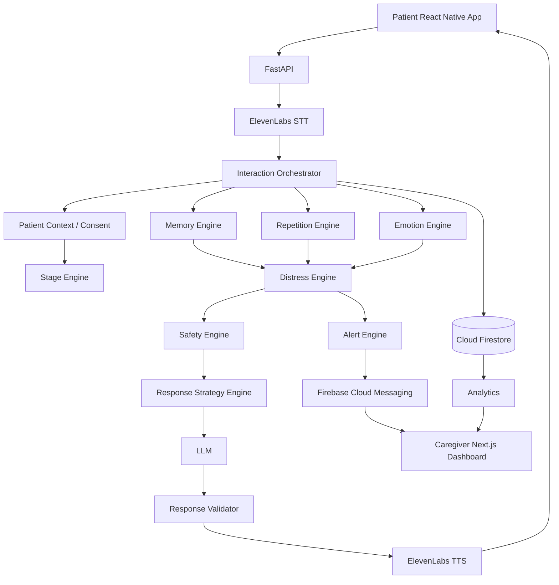

# GeriCare AI - Backend

Voice-first, stage-adaptive AI companion backend for dementia care. This service connects the
React Native + Expo patient app and the Next.js caregiver/family website to Firebase, ElevenLabs
speech services, an LLM, and a set of custom safety/strategy engines that sit *around* the LLM.

## The core principle

**The LLM is not GeriCare.** GeriCare is the intelligence and safety architecture surrounding the
LLM: verified biography + consent + cognitive stage + semantic repetition + emotion + distress +
behaviour pattern + safety policy + response strategy + caregiver escalation. The LLM only turns
the resulting structured decision into natural, compassionate language - it never independently
decides what's safe to say, how a patient should be addressed, or whether to escalate.



## Interaction pipeline

```text
Patient Speech -> STT -> Patient Identity -> Biographical Memory -> Recent Conversation Context
  -> Cognitive Stage -> Semantic Repetition -> Emotion -> Distress Risk -> Time/Behaviour Pattern
  -> Hallucination/Delusion Safety -> Response Strategy -> LLM -> Response Safety Validator
  -> TTS -> Patient
```

Implemented end-to-end in [`app/ai/orchestrator.py`](app/ai/orchestrator.py); every engine it calls
lives in its own module under `app/ai/` and is independently unit-testable.

## Project structure

```text
backend/
├── app/
│   ├── main.py                 FastAPI app, lifespan, error handlers, health checks
│   ├── config.py                pydantic-settings configuration
│   ├── dependencies.py          FastAPI dependency wiring (auth, repos, services)
│   ├── api/v1/                  Route handlers (thin - delegate to services/orchestrator)
│   ├── core/                    security, exceptions, logging, permissions, audit, rate limiting
│   ├── database/                Firebase init + Firestore/Storage repositories
│   ├── ai/                      Every GeriCare engine (stage, repetition, emotion, distress,
│   │                            safety, strategy, memory, pattern, embeddings, LLM, orchestrator)
│   ├── services/                Business logic between routes and repositories
│   ├── schemas/                 Pydantic request/response contracts (patient-safe vs caregiver)
│   ├── models/enums.py          Shared enums
│   └── utils/                   datetime, similarity, audio helpers
├── tests/
│   ├── unit/                    Pure-function engine tests (no Firebase/LLM/ElevenLabs)
│   └── integration/             Orchestrator safety tests using in-memory fakes
├── scripts/initialize_firestore.py   Prints required indexes; can grant the first admin role
├── firestore.indexes.json       Composite indexes this backend requires
├── Dockerfile
└── .env.example
```

## Technology stack

FastAPI, Uvicorn, Pydantic v2, pydantic-settings, Firebase Admin SDK (Firestore, Storage, FCM,
Auth), httpx, ElevenLabs REST API (STT + TTS), an OpenRouter-compatible LLM API, Sentence
Transformers, NumPy, structlog, PyJWT, pytest.

## No mock data

There is no runtime fake patient, memory, alert, or conversation data anywhere in this codebase.
Every endpoint either returns real Firestore-backed data, an empty result, or a controlled error.
Test fixtures (in `tests/`) are the only place synthetic data exists.

---

## Firebase setup

1. Create/select a Firebase project (this repo was scaffolded against project `sechack-3c0a1`).
2. Enable **Firestore**, **Storage**, **Authentication**, and **Cloud Messaging**.
3. Grant the backend credentials to call the Admin SDK. There are two ways - pick one:

   **Option A - Application Default Credentials (recommended, no key file at all).** Many Google
   Cloud projects now enforce the `iam.disableServiceAccountKeyCreation` org policy by default,
   which blocks "Generate new private key" entirely (you'll see *"Key creation is not allowed on
   this service account"*). `app/database/firebase.py` already falls back to
   `credentials.ApplicationDefault()` whenever `FIREBASE_SERVICE_ACCOUNT_PATH` is unset or the file
   doesn't exist, so just authenticate the gcloud CLI once on your machine as the project owner:

   ```bash
   gcloud auth application-default login
   gcloud auth application-default set-quota-project sechack-3c0a1
   ```

   Leave `FIREBASE_SERVICE_ACCOUNT_PATH=` empty in `.env`. This is also exactly how Cloud Run
   should run in production - attach a service account to the Cloud Run *service* itself and the
   metadata server supplies credentials automatically, with no key file ever created or shipped.

   **Option B - a downloaded service account key** (only if key creation isn't blocked for your
   project, or an org admin lifts `iam.disableServiceAccountKeyCreation` under IAM & Admin ->
   Organization Policies for the project). Project settings -> Service accounts -> Generate new
   private key, save it locally as `firebase-service-account.json` (gitignored), and point
   `FIREBASE_SERVICE_ACCOUNT_PATH` at it in `.env`. This is a *different* credential from the web
   `firebaseConfig` object used by the frontends - the backend needs the Admin SDK JSON, never the
   client SDK config.
4. Deploy the composite indexes in `firestore.indexes.json`:
   `firebase deploy --only firestore:indexes`.

### Firestore collections

```text
users/{userId}
patients/{patientId}
patients/{patientId}/family/{familyId}
patients/{patientId}/memories/{memoryId}
patients/{patientId}/conversations/{conversationId}
patients/{patientId}/conversation_events/{eventId}
patients/{patientId}/repetition_events/{eventId}
patients/{patientId}/distress_events/{eventId}
patients/{patientId}/behaviour_patterns/{patternId}
patients/{patientId}/alerts/{alertId}
patients/{patientId}/consents/default
patients/{patientId}/calming_strategies/{strategyId}
patients/{patientId}/activities/{activityId}
patients/{patientId}/devices/{deviceId}
pairing_codes/{hashedCode}          (top-level, hashed, one-time-use, TTL)
media/{mediaId}                     (top-level, resolves media ownership for delete)
```

### First admin account

Sign in once via Firebase Auth from either frontend to create the Auth user, then grant the first
admin role directly:

```bash
python scripts/initialize_firestore.py --admin-uid <the-firebase-uid>
```

From there, `POST /api/v1/auth/roles` (admin-only) can promote further caregiver/family accounts.
The frontend can never assign its own role - `users/{uid}.role` in Firestore is authoritative.

---

## ElevenLabs setup

Create an API key at elevenlabs.io, then set:

```env
ELEVENLABS_API_KEY=...
ELEVENLABS_STT_MODEL=scribe_v1
ELEVENLABS_TTS_MODEL=eleven_turbo_v2_5
ELEVENLABS_VOICE_ID=<a calm, slower-paced voice id from your ElevenLabs voice library>
```

The key is used **only** server-side (`app/ai/speech/stt.py`, `app/ai/speech/tts.py`) - neither
frontend ever talks to ElevenLabs directly.

## LLM configuration

The backend talks to an OpenAI-compatible chat-completions endpoint via `app/ai/llm_service.py`.
`LLM_PROVIDER=openrouter` is implemented out of the box (https://openrouter.ai). Set:

```env
LLM_PROVIDER=openrouter
LLM_API_KEY=...
LLM_MODEL=anthropic/claude-3.5-sonnet
```

To add another OpenAI-compatible provider, extend `_endpoint_and_headers()` in `llm_service.py` -
no other file needs to change.

## Embedding model

`EMBEDDING_MODEL=sentence-transformers/all-MiniLM-L6-v2` by default. Loaded exactly once at
application startup (`app/main.py` lifespan) via `app/ai/embeddings.py`, never per-request.

---

## Local development

```bash
cd backend
python -m venv .venv
source .venv/Scripts/activate   # Windows Git Bash; use .venv/bin/activate on macOS/Linux
pip install -r requirements.txt
cp .env.example .env            # then fill in real values
uvicorn app.main:app --reload
```

Visit `http://localhost:8000/docs` for interactive OpenAPI docs.

### Environment variables

See [`.env.example`](.env.example). Mandatory in production (validated at startup, see
`Settings.validate_production_secrets`): `FIREBASE_PROJECT_ID`, `FIREBASE_SERVICE_ACCOUNT_PATH`,
`ELEVENLABS_API_KEY`, `LLM_API_KEY`, `JWT_SECRET`.

---

## Authentication

Two independent identity flows:

- **Caregiver / family / admin** (the Next.js website): Firebase ID token in
  `Authorization: Bearer <token>`, verified server-side via the Firebase Admin SDK
  (`app/core/security.py::verify_firebase_id_token`). The role used for authorization always comes
  from `users/{uid}.role` in Firestore, never a client-asserted claim.
- **Patient device** (the Expo app): a short-lived JWT issued by this backend after a successful
  pairing-code exchange (`app/services/pairing_service.py`), also sent as a Bearer token.

A handful of endpoints (`GET /patients/{id}`, `/family`, `/memories`, `/comfort`,
`/activities/recommended`) are shared by both apps per the frontend contract; they use
`get_patient_access_context` (`app/dependencies.py`) to authenticate either token type and return
a sanitized, patient-safe shape when the caller is a device, or the full admin shape for
caregivers/family.

## Device pairing

```text
Caregiver: POST /api/v1/pairing/{patientId}/code   -> { pairing_code, expires_at }
Patient app: POST /api/v1/pairing/verify           -> { accessToken, refreshToken, patientId }
```

Codes are hashed at rest, expire after `PAIRING_CODE_TTL_SECONDS`, and are single-use
(`app/database/repositories/device_repository.py::PairingRepository`).

## Memory architecture

Three distinct forms (spec-aligned), all consent-gated before ever reaching the LLM
(`app/services/consent_service.py`):

- **Biographical memory** - persistent facts on the patient record + `memories` subcollection.
- **Conversation memory** - a *bounded* recent window (`ConversationEventRepository`), never the
  full history.
- **Behavioural memory** - `repetition_events`, `distress_events`, `behaviour_patterns`, and
  `calming_strategies`, used by the strategy engine and caregiver analytics.

Semantic memory retrieval (`app/ai/memory_engine.py`) complements, but does not replace, structured
fact lookup for simple relationships (e.g. "who is Priya?" is answered from the `family`
subcollection, not vector search).

## AI orchestration & safety architecture

See `app/ai/orchestrator.py` for the full sequencing and the module docstrings in `app/ai/*` for
each engine's contract. Key guarantees, enforced with tests in `tests/unit` and
`tests/integration`:

- The dementia stage is caregiver-configured, never AI-inferred (`app/ai/stage_engine.py`).
- Repetition is detected semantically (cosine similarity over embeddings), not by exact text match,
  and never produces a hostile/dismissive strategy.
- The safety engine never confirms an unverified belief, argues, or ridicules - only validates
  emotion and offers reassurance/redirection (`app/ai/safety_engine.py`).
- Immediate-danger language takes a separate emergency path that skips normal conversation and
  forces caregiver escalation.
- The response validator (`app/ai/response_validator.py`) runs before TTS and blocks restricted
  memory disclosure, internal metadata leaks, unsupported medical claims, and confirmed unverified
  beliefs - regenerating once, then falling back to a generic, fact-free reassurance.
- If the LLM is unavailable, the fallback response never invents personal facts.

## Consent architecture

`patients/{id}/consents/default` gates every AI use of biography/memory. `ConsentService` exposes
pure predicate functions (`is_memory_allowed_for_ai`, `may_mention_memory_directly`, etc.) used by
the orchestrator *before* any data reaches the LLM - never enforced only in the UI.

## Analytics

`app/services/analytics_service.py` computes repetition, distress, evening-pattern, and
calming-strategy analytics from real stored events only. Insufficient data is reported as
insufficient (`dataSufficient: false`), never fabricated or ranked meaningfully.

## Testing

```bash
pytest                 # unit + integration, no real external services touched
ruff check .
mypy app
```

`tests/integration/test_orchestrator_safety.py` implements the critical safety tests from the spec:
restricted memories are never disclosed even if the LLM leaks them, LLM failure never fabricates
personal facts, and emergency language reliably creates an urgent alert + caregiver notification.

## Docker / Cloud Run

```bash
docker build -t gericare-backend .
docker run -p 8080:8080 --env-file .env gericare-backend
```

Deploy to Cloud Run with `gcloud run deploy --service-account <runtime-sa>@sechack-3c0a1.iam.gserviceaccount.com`,
leaving `FIREBASE_SERVICE_ACCOUNT_PATH` unset - Cloud Run's metadata server supplies Application
Default Credentials for the attached service account automatically, so no key file is generated,
shipped, or baked into the image (this also sidesteps `iam.disableServiceAccountKeyCreation`
entirely). Grant that runtime service account the `roles/datastore.user`,
`roles/firebase.sdkAdminServiceAgent`, and `roles/storage.objectAdmin` IAM roles. Inject the
remaining secrets (`ELEVENLABS_API_KEY`, `LLM_API_KEY`, `JWT_SECRET`) via Secret Manager. Render is
a viable alternative: set the same environment variables, use
`uvicorn app.main:app --host 0.0.0.0 --port $PORT` as the start command, and use Option B (a
service account key file mounted as a secret file) since Render has no equivalent of Cloud Run's
attached-identity metadata server.

## Security guidance

- Every protected route checks patient ownership/family access server-side
  (`app/core/permissions.py`) - a `patientId` in the URL is never trusted on its own.
- Consent is enforced before any LLM call, not only in UI controls.
- Media uploads validate MIME type, extension, and size, and never trust the client filename for
  storage paths.
- Rate limiting guards pairing verification, auth, and voice uploads
  (`app/core/rate_limit.py`) - it never throttles a patient's own repeated questions, which the
  repetition engine handles on its own terms.
- CORS is restricted to `CORS_ORIGINS`, never `*`.
- Structured logs never contain transcripts, tokens, or API keys (`app/core/logging.py` scrubs
  known-sensitive keys); audit events (`app/core/audit.py`) record who changed what, not raw
  content.
